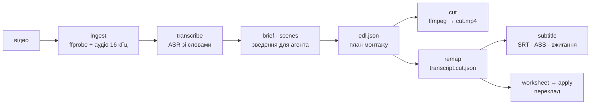

# videoworks

> Агент читає відео як текст, планує монтаж і рендерить результат — з транскрибацією, субтитрами та відтворюваними правками.


Замість того щоб «дивитися» відео, агент отримує його транскрипт зі словами й
таймкодами, ухвалює рішення в тексті та повертає план монтажу. Пайплайн рендерить
цей план через ffmpeg, перемаплює таймкоди під змонтоване відео й видає субтитри,
які синхронні **за побудовою**.



## Зміст

- [Можливості](#можливості)
- [Вимоги](#вимоги)
- [Встановлення](#встановлення)
- [Швидкий старт](#швидкий-старт)
- [Команди](#команди)
- [Монтаж агентом](#монтаж-агентом)
- [Як тримається синхронність](#як-тримається-синхронність)
- [Переклад](#переклад)
- [Вибір ASR-бекенда](#вибір-asr-бекенда)
- [Структура проєкту](#структура-проєкту)
- [Розробка](#розробка)
- [Референси](#референси)
- [Статус і плани](#статус-і-плани)
- [Ліцензія](#ліцензія)

## Можливості

- **Транскрибація на GPU** з рівнем слова — faster-whisper, whisperX або MOSS на вибір.
- **Монтаж по EDL** з preflight-валідацією та receipt: хеші входів, версії тулів, команда.
- **Перемапування таймкодів** замість повторного ASR — субтитри лишаються синхронними.
- **Субтитри** SRT / VTT / ASS з розкладкою на рядки, вжиганням у кадр і мʼяким муксом.
- **Агентний шар** — skill для Claude Code: стисле зведення, план, показ правок до рендеру.
- **Переклад** із бюджетом символів на репліку та глосарієм; перекладає агент, не MT-рушій.
- **Бенчмарк ASR** на одному матеріалі: швидкість, WER, точність меж слів, спікери.
- **Експорт у FCPXML** для доведення руками в Resolve / Premiere / Final Cut.

## Вимоги

| | |
|---|---|
| Python | 3.12 (саме 3.12 — `requires-python = ">=3.12,<3.13"`) |
| Менеджер пакетів | [uv](https://docs.astral.sh/uv/) |
| ffmpeg | зібраний з `libass`; для `--encoder nvenc` — з NVENC |
| GPU | NVIDIA з CUDA — опційно, але без неї ASR іде на процесорі |

Перевірено на: RTX 4060 Laptop 8 ГБ, ffmpeg 9.0.1 (libass + nvenc), Python 3.12.14,
faster-whisper 1.2.1 на `cuda/float16`, Windows 11.

> [!NOTE]
> Системний Python 3.14 для ML-стека не годиться — `uv sync` створює venv на 3.12.
> `_cuda.py` додає `site-packages/nvidia/*/bin` у шлях пошуку DLL: без цього
> CTranslate2 падає з `Could not locate cudnn_ops64_9.dll`.

## Встановлення

```powershell
git clone https://github.com/devik71/videoworks.git
cd videoworks
uv sync                     # venv на Python 3.12 + залежності
uv run videoworks doctor    # перевірити ffmpeg, CUDA, моделі
```

Важкі ASR-бекенди ставляться окремо — вони потрібні лише тим, хто їх міряє:

```powershell
uv sync --extra whisperx
uv sync --extra moss
```

> [!IMPORTANT]
> `pyproject.toml` навмисно тягне `torch` із `download.pytorch.org/whl/cu128`:
> колесо з PyPI під Windows — без CUDA (`2.14.0+cpu`), і обидва бекенди мовчки
> поїхали б на процесор. `torch` і `torchaudio` названі в екстрах явно, бо
> `tool.uv.sources` діє лише на прямі залежності, а сюди вони приходять
> транзитивно. MOSS ставиться з git — на PyPI його немає.

## Швидкий старт

```powershell
uv run videoworks init myvideo
# кинути файл у projects\myvideo\media\
uv run videoworks transcribe myvideo --lang uk
uv run videoworks trim myvideo --max-pause 0.6
uv run videoworks cut myvideo
uv run videoworks subtitle myvideo --format srt,ass --burn --soft
```

На виході:

```text
projects\myvideo\
  transcript.raw.json      слова, таймкоди — вхід для всього іншого
  edl.json                 план монтажу (від trim або від агента)
  transcript.cut.json      таймкоди, перемаплені під змонтоване відео
  subs\uk.srt · uk.ass     репліки, готові до правки
  out\cut.mp4              змонтоване відео
  out\cut.receipt.json     провенанс: хеші входів, EDL, версії тулів, команда
  out\subtitled.mp4        субтитри вжиті в кадр
  out\subtitled.mkv        ті самі субтитри окремим треком
  out\myvideo.fcpxml       для доведення руками в Resolve / Premiere / FCP
```

`cut --dry-run` проганяє лише preflight. `subtitle` сам бере пару
`transcript.cut.json` + `cut.mp4`, якщо монтаж уже зроблено.

Корисні ключі: `--max-line 42`, `--max-lines 2`, `--cps 17`, `--font "Arial"`,
`--encoder nvenc`.

## Команди

```powershell
uv run videoworks --help
```

| Команда | Що робить |
|---|---|
| `doctor` | Перевіряє оточення: ffmpeg, CUDA, моделі |
| `init` | Створює папку проєкту |
| `ingest` | Витягує метадані й аудіодоріжку 16 кГц |
| `transcribe` | Транскрибує проєкт у `transcript.raw.json` |
| `scenes` | Знаходить склейки → `scenes.json` |
| `brief` | Стисле зведення для агента: метадані, сцени, транскрипт на рівні фраз |
| `review` | Показує, що саме зникне за поточним `edl.json` — словами, а не числами |
| `filmstrip` | Збирає контактний аркуш кадрів, коли тексту мало |
| `trim` | Будує `edl.json`, викидаючи довгі паузи — чорновий монтаж без агента |
| `cut` | Рендерить `edl.json` і перемаплює транскрипт під змонтоване відео |
| `fcpxml` | Експортує `edl.json` у FCPXML |
| `subtitle` | Транскрипт → репліки → SRT/VTT/ASS, за потреби вжиті в кадр |
| `benchmark` | Міряє ASR-бекенди: швидкість, WER, точність меж слів |
| `worksheet` | Готує аркуш для перекладу: правила, глосарій, бюджет символів |
| `apply` | Підставляє готовий переклад у ті самі таймкоди |
| `check` | Перевіряє субтитри на придатність |
| `edit` | Показує репліки з метриками; масово скорочує задовгі |
| `preview` | Локальний переглядач: відео, підпис у кадрі й список реплік |
| `show` | Показує стан проєкту |

<details>
<summary>Запуск без <code>uv run</code></summary>

```powershell
.venv\Scripts\videoworks doctor
.venv\Scripts\python -m videoworks.cli doctor
```

</details>

## Монтаж агентом

У репо є skill для Claude Code (`.claude/skills/videoworks/`). Досить сказати
«прибери паузи й зайве з projects/myvideo» — агент прочитає зведення, напише
план, покаже його й дочекається згоди.

```powershell
uv run videoworks scenes myvideo               # межі склейок
uv run videoworks brief myvideo                # стисле зведення
uv run videoworks review myvideo               # що саме зникне
uv run videoworks filmstrip myvideo --start 40 --end 70
```

`brief` — компактна форма транскрипту на рівні фраз: word-level JSON у контекст
не влазить, та й рішення про різку на рівні слів не приймаються. `review` показує
план у словах, а не в числах — його треба бачити до рендеру.

## Як тримається синхронність

Транскрипт робиться **один раз, до монтажу** — без тексту агент не може
планувати різку. Після різки таймкоди не транскрибуються заново, а перемаплюються
арифметично через EDL:

```text
слово лишається, якщо його середина потрапила в інтервал EDL
w.start_new = w.start - seg.src_in + seg.dst_out
```

Повторний ASR по змонтованому відео дав би інші слова й іншу пунктуацію і
зруйнував би звʼязок із рішеннями агента. Через перемапування субтитри синхронні
**за побудовою**, а не завдяки підгонці. `remap_transcript` покрита тестами
першою — це найкритичніша функція в проєкті.

## Переклад

Перекладає агент — окремого MT-рушія немає й не треба. Тул дає круговий обмін:

```powershell
uv run videoworks worksheet myvideo --to en --save
# агент перекладає subs\en.draft.md
uv run videoworks apply myvideo --lang en
uv run videoworks check myvideo --lang uk
```

Аркуш містить правила, глосарій і **бюджет символів** на кожну репліку —
менше з двох обмежень: фізичного розміру (рядки × символи) і швидкості читання
(тривалість × CPS). `apply` підставляє переклад у ті самі таймкоди, перераховує
розкладку і **не запише результат**, який не влазить.

Терміни — у `projects/<name>/glossary.tsv`: `термін<TAB>переклад`, порожній
переклад означає «лишити як є».

## Вибір ASR-бекенда

```powershell
uv run videoworks benchmark myvideo --reference projects\myvideo\reference.txt --models small,large-v3 --lang uk
```

```text
бекенд                      пристрій      ×RT      WER   медіана   спікери
--------------------------------------------------------------------------
faster-whisper/small        cuda        13.6×    15.4%    154 мс         —
faster-whisper/large-v3     cuda        12.3×     7.7%    223 мс         —
whisperx/small              cuda         6.9×     7.7%         —         —
whisperx/large-v3           cuda         6.0×     0.0%         —         —
```

Еталон `.txt` дає лише WER; `.json` у форматі `Transcript` — ще й точність меж
слів. Саме вона вирішує долю монтажу: 200 мс похибки — це різ посеред складу.

На пробному матеріалі межі faster-whisper розходяться з forced alignment
whisperX на 154–223 мс — удвічі більше за поріг, за яким шов чути. Тому для
монтажу є `transcribe --backend whisperx`, хоч він і вдвічі повільніший.

> [!NOTE]
> **MOSS не дає рівня слова** — ні `TranscriptSegment`, ні `SubtitleSegment` у його
> моделі не мають слів. Основним бекендом він бути не може, зате дає діаризацію без
> закритих ваг pyannote: `diarize.assign_speakers` зшиває слова з faster-whisper зі
> спікерами з MOSS.

Для української у whisperX є штатна фонемна модель
(`Yehor/wav2vec2-xls-r-300m-uk-with-small-lm`), тож forced alignment не деградує.

## Структура проєкту

```text
src/videoworks/
  models.py         — контракти: Transcript, Edl, Receipt
  paths.py          — розкладка папки проєкту
  ingest.py         — ffprobe + витяг аудіо 16 кГц
  asr/              — ASRBackend + реалізації (faster-whisper, whisperX, MOSS)
  text.py           — склеювання токенів ASR, відмінювання числівників
  scenes.py         — детекція склейок (PySceneDetect)
  brief.py          — стисле зведення для агента + review плану
  filmstrip.py      — контактні аркуші кадрів на вимогу
  subtitles.py      — репліки, розкладка на рядки, експорт SRT/VTT/ASS
  burn.py           — вжигання через libass, мʼякий мукс у MKV
  edl.py            — побудова EDL, preflight, remap_transcript
  render.py         — EDL → ffmpeg → cut.mp4 + receipt
  fcpxml.py         — експорт EDL у FCPXML
  translate.py      — аркуш перекладу, глосарій, бюджет, перевірка придатності
  metrics.py        — WER, точність меж слів, узгодженість спікерів
  benchmark.py      — порівняння ASR-бекендів на одному матеріалі
  diarize.py        — перенесення спікерів на транскрипт зі словами
  diagnostics.py    — спільний тип Problem для всіх перевірок
  cli.py            — typer CLI
  _cuda.py          — бутстрап cuDNN/cuBLAS DLL для CTranslate2 на Windows
.claude/skills/
  videoworks/       — skill: як агенту монтувати через цей пайплайн
docs/
  landscape.md      — що вже існує, зірки, ліцензії, що з цього брати
  architecture.md   — архітектура пайплайну
  roadmap.md        — наскрізний потік і етапи М0–М6
  transcription.md  — план тулу транскрибації та субтитрів
refs/
  refs.yaml         — каталог зовнішніх репо з поясненням, навіщо кожен
  repos.tsv         — той самий список у машинному вигляді (для скрипта)
scripts/
  fetch-refs.ps1    — shallow-клон референсів у vendor/
vendor/             — зовнішні репо (в git не комітяться)
projects/           — робочі проєкти з медіа (локальні, не комітяться)
```

## Розробка

```powershell
uv run pytest        # 168 тестів
uv run ruff check .
uv run ruff format .
```

`remap_transcript` в `edl.py` — найкритичніша функція: будь-яка зміна в ній має
йти разом із тестами в `tests/test_edl.py`.

## Референси

Каталог зовнішніх репо, які варто читати, лежить у `refs/`. Клонувати:

```powershell
.\scripts\fetch-refs.ps1 -List            # подивитись каталог
.\scripts\fetch-refs.ps1 -Tier core       # клонувати найважливіше
.\scripts\fetch-refs.ps1 -Group transcription
.\scripts\fetch-refs.ps1 -Name video-use,kinocut -Update
```

Клонує з `--depth 1 --filter=blob:none`, тому навіть великі репо тягнуться швидко.

Ключові знахідки:

- **[video-use](https://github.com/browser-use/video-use)** (MIT) — найближчий
  аналог. Text-first підхід: LLM не дивиться відео, а читає word-level транскрипт.
  Стартова точка.
- **[kinocut](https://github.com/KyaniteLabs/mcp-video)** (Apache-2.0) — MCP-сервер над
  FFmpeg із guardrails: preflight-валідація, «Video Receipts», fail-closed. Те, чого
  бракує саморобним обгорткам.
- **[OpenMontage](https://github.com/calesthio/OpenMontage)** (AGPL-3.0) — як
  пакувати доменні знання в skills. Ліцензія копілефтна: беремо ідеї, не код.
- **[faster-whisper](https://github.com/SYSTRAN/faster-whisper)** · **[whisperX](https://github.com/m-bain/whisperX)** ·
  **[MOSS-Transcribe-Diarize](https://github.com/OpenMOSS/MOSS-Transcribe-Diarize)** —
  три кандидати в ASR-бекенд, вибір після бенчмарку на українській.
- **[OpenCut](https://github.com/OpenCut-app/OpenCut)** (MIT) — цільовий редактор,
  але зараз переписується з нуля; MCP і headless ще не готові. Не залежність, а ціль.

Деталі й ліцензійні межі — у [docs/landscape.md](docs/landscape.md).

## Статус і плани

**М0–М5 готові.** М6 — оснастка є, замір чекає українського матеріалу.

Наступний крок: **замір на реальному українському матеріалі**. Потрібен запис
на 2–5 хвилин із вивіреним текстом — синтетика для WER не годиться.

Повний план — [docs/roadmap.md](docs/roadmap.md).
Архітектура — [docs/architecture.md](docs/architecture.md).

## Ліцензія

Ліцензію ще не обрано — за замовчуванням це означає «всі права застережено».
Перед тим як робити репозиторій публічним, треба додати `LICENSE` і поле
`license` у `pyproject.toml`.
